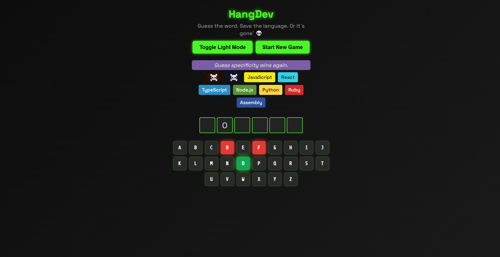
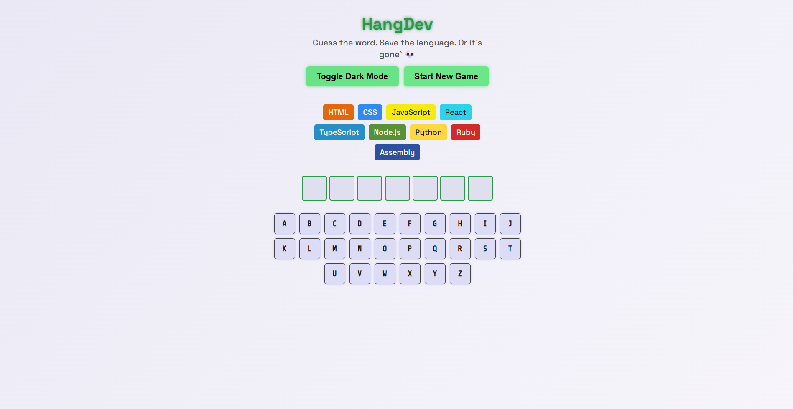
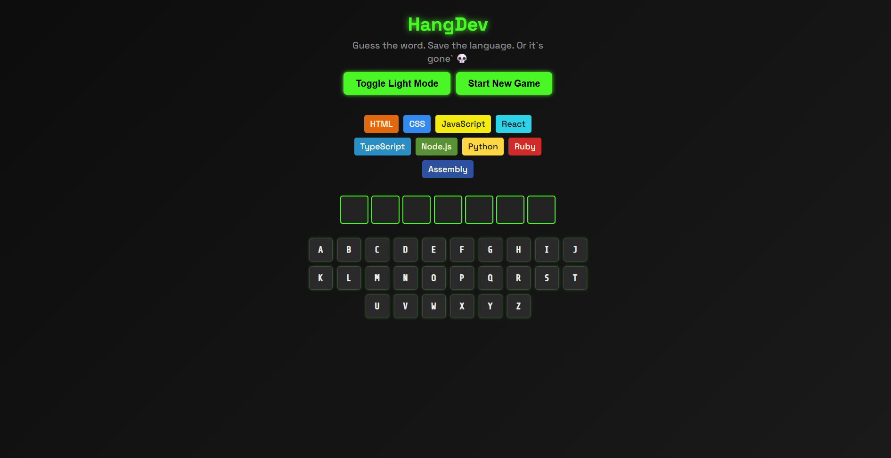
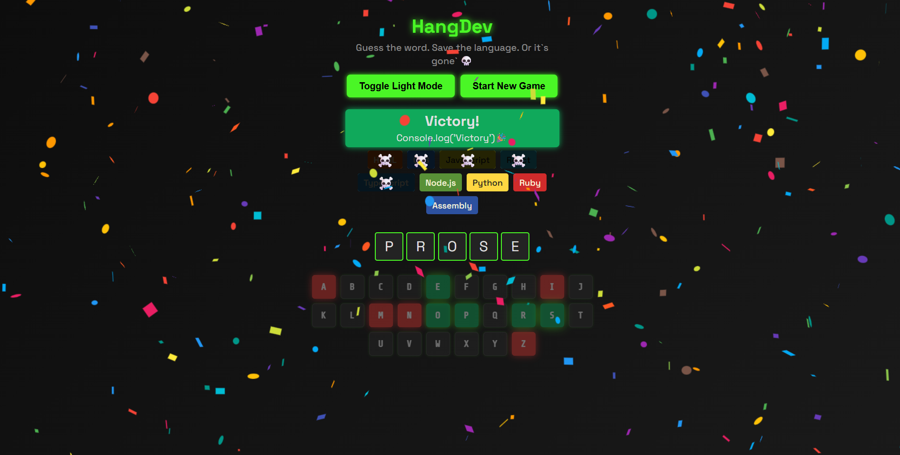

# HangDev

**Guess the word. Save the language. Or it’s gone 💀**

---

## Description

HangDev is a modern, developer-themed take on the classic Hangman game. Your mission: guess the name of a programming language, letter by letter. Each wrong guess puts a language “in danger”—lose too many times, and the language is “eliminated” from the list! HangDev features dark/light mode, visual effects, accessibility, and saves your progress locally.

---

## Demo

👉 **[Live Demo (Netlify)](https://hangdevrmc.netlify.app/)**  



---

## Features

- ✨ Modern, responsive interface (desktop & mobile)
- 💡 Light/Dark mode toggle
- ♻️ Persistent progress (localStorage)
- 🧩 Virtual keyboard with visual feedback and physical keyboard support
- 🎉 Confetti effects on win
- 🦾 Accessibility for screen readers
- 🔤 Popular programming languages (easily customizable)
- 🔁 Quick new game start

---

## Built With

- [React 18](https://react.dev/)
- [Vite](https://vitejs.dev/)
- CSS3 (custom, no UI framework)
- [clsx](https://github.com/lukeed/clsx) for dynamic class names
- [react-confetti](https://github.com/alampros/react-confetti) for visual effects

---

## Getting Started

Clone and run locally:

```bash
git clone https://github.com/CosminMRotaru/h.git
cd h
npm install
npm run dev
```

App runs at [http://localhost:5173](http://localhost:5173) by default.

---

## Project Structure

```text
h/
├── App.jsx
├── index.jsx
├── index.css
├── words.js
├── languages.js
├── utils.js
├── vite.config.js
├── eslint.config.js
├── package.json
├── README.md
├── public/
│   └── favicon.ico
├── screenshots/
│   └── hangdev-demo.png
```

---

## Customization

- **Add/edit languages:** in `languages.js`
- **Add/edit playable words:** in `words.js`
- **Themes:** adjust or extend CSS (`index.css`)
- **Effects/animations:** see the keyframes section of the CSS

---

## Screenshots





---

## Author

Cosmin M. Rotaru  
[GitHub](https://github.com/CosminMRotaru)  
[LinkedIn](https://www.linkedin.com/in/marius-cosmin-rotaru-a8a242262/)

---

## License

MIT
